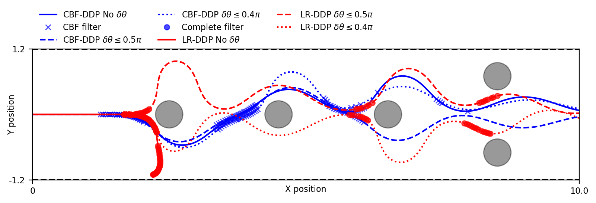
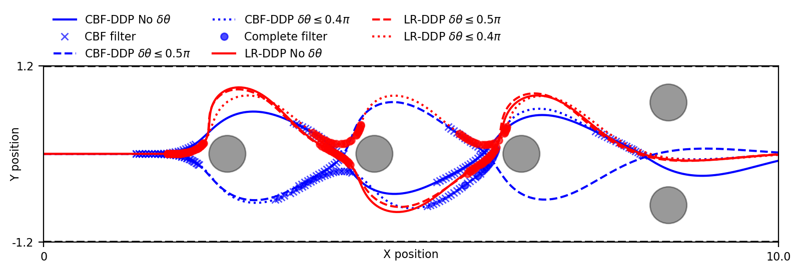
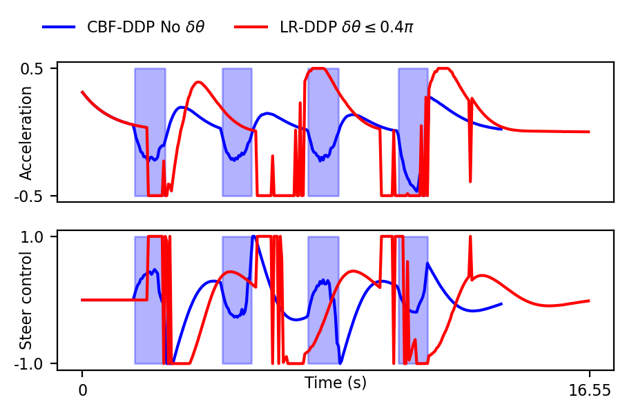

# Fast, Smooth and Safe - LCSS + CDC submission

This code is the companion to results in https://sites.google.com/view/fsslcss/home .
Here, we construct a CBF up to second-order in real-time using DDP optimization. Then, the online quadratic program is solved to obtain the filtered safety control. Without interfering constraints, the filtered controls display better smoothness properties. With multiple interfering constraints from yaw and road boundaries, controls are jerkier but behavior of trajectories is safer and smoother. We use JAX to obtain acceleration while running on a CPU.

Further, the directory numpy_dubins contains our numpy testing framework on the 3D dubins car.

Python dependencies for running the code is available inside *requirements.txt*. 

The yaml file format for providing configuration is */test_configs/reachavoid/test_config_cbf_reachavoid_circle_cbf_config1.yaml*

To reproduce experiments in the paper, it is sufficient to run:

```
  python test_yaw_constraints.py -cf ./test_configs/reachavoid/test_config_cbf_reachavoid_circle_config1.yaml --naive_task -pt reachavoidcf1_naive_task -rb 1.2
```

Here, -cf defines the config files, --naive_task toggles the naive task policy that uses hand-tuned linear feedback to enable task completion, -pt defines the tag id for saving the plots and -rb defines the road boundary limits. The applicability of the naive policy is limited.

The corresponding trajectories and controls plots are generated inside */plots_paper*.

 

Using the elaborately tuned ILQR policy with multiple cost functions and weights to adjust various desiderata, it is possible to see that both LR-DDP and CBF-DDP are enough to result in guaranteed safe filtering without compromising on task completion.
```
python test_yaw_constraints.py -cf ./test_configs/reachavoid/test_config_cbf_reachavoid_circle_config1.yaml -pt reachavoidcf1_lqr_task -rb 1.2
```
The corresponding trajectories and controls plots:

 

An extensive set of tests performed to check robustness is available inside **test_scripts.sh**

```
# Paper scripts
python test_yaw_constraints.py -cf ./test_configs/reachavoid/test_config_cbf_reachavoid_circle_config1.yaml --naive_task -pt reachavoidcf1_naive_task -rb 1.2
python test_yaw_constraints.py -cf ./test_configs/reachavoid/test_config_cbf_reachavoid_circle_config1.yaml --naive_task -pt reachavoidcf1_naive_task_squeeze -rb 1.0
python test_yaw_constraints.py -cf ./test_configs/reachavoid/test_config_cbf_reachavoid_circle_config1.yaml -pt reachavoidcf1_lqr_task -rb 1.2
python test_yaw_constraints.py -cf ./test_configs/reachavoid/test_config_cbf_reachavoid_circle_config1.yaml -pt reachavoidcf1_lqr_task_squeeze -rb 1.0

# Robustness checks and staggered obstacles
python test_yaw_constraints.py -cf ./test_configs/reachavoid/test_config_cbf_reachavoid_circle_config2.yaml -pt reachavoidcf2_lqr_task -rb 1.2
python test_yaw_constraints.py -cf ./test_configs/reachavoid/test_config_cbf_reachavoid_circle_config2.yaml --naive_task -pt reachavoidcf2_naive_task -rb 1.2
python test_yaw_constraints.py -cf ./test_configs/reachavoid/test_config_cbf_reachavoid_circle_config3.yaml -pt reachavoidcf3_lqr_task -rb 1.2

# Different wheelbase
python test_yaw_constraints.py -cf ./test_configs/reachavoid/test_config_cbf_reachavoid_circle_config4.yaml -pt reachavoidcf4_lqr_task -rb 1.2

# Check whether everything stops
python test_yaw_constraints.py -cf ./test_configs/reachavoid/test_config_cbf_reachavoid_circle_config2.yaml --naive_task -pt reachavoidcf2_naive_task_squeeze -rb 1.0
python test_yaw_constraints.py -cf ./test_configs/reachavoid/test_config_cbf_reachavoid_circle_config2.yaml -pt reachavoidcf2_lqr_task_squeeze -rb 1.0
```


